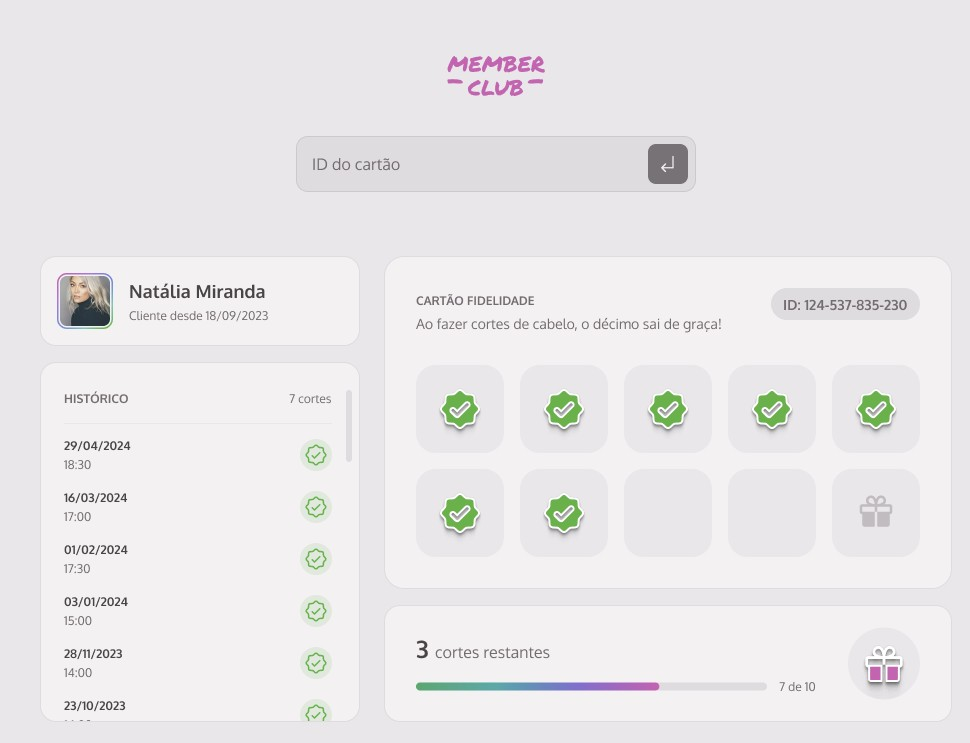

<h1 align="center">Member Club</h1>

<p align="center">Este projeto implementa um sistema de cartão fidelidade.</p>


<p align="center">
  
</p>


```bash
npm init -y
npm i webpack -D
npm i webpack-cli -D
npm i webpack-dev-server -D
npm i html-webpack-plugin -D
npm i copy-webpack-plugin -D
npm i css-loader
npm i json-server
npm i style-loader
```
